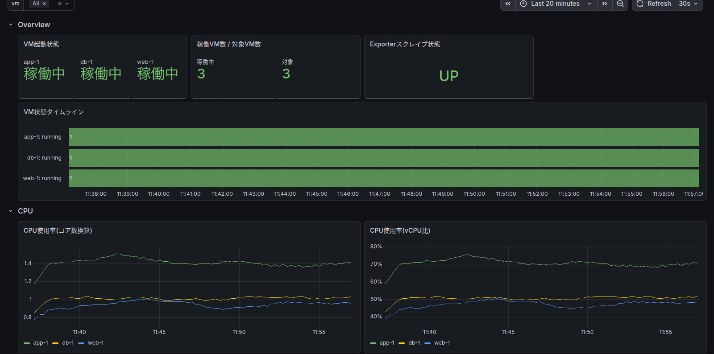
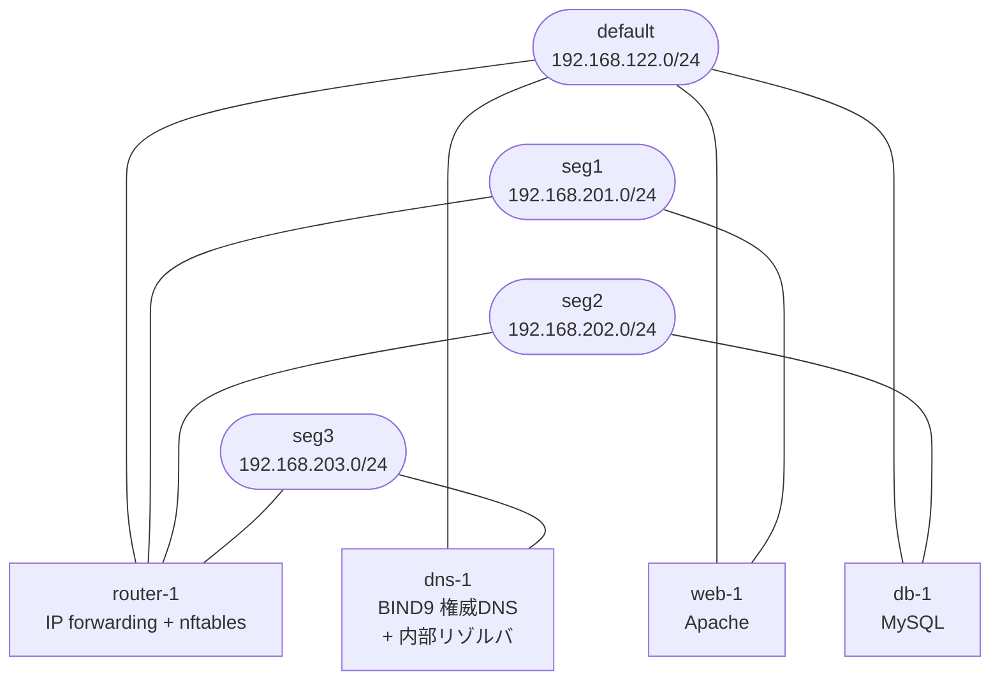
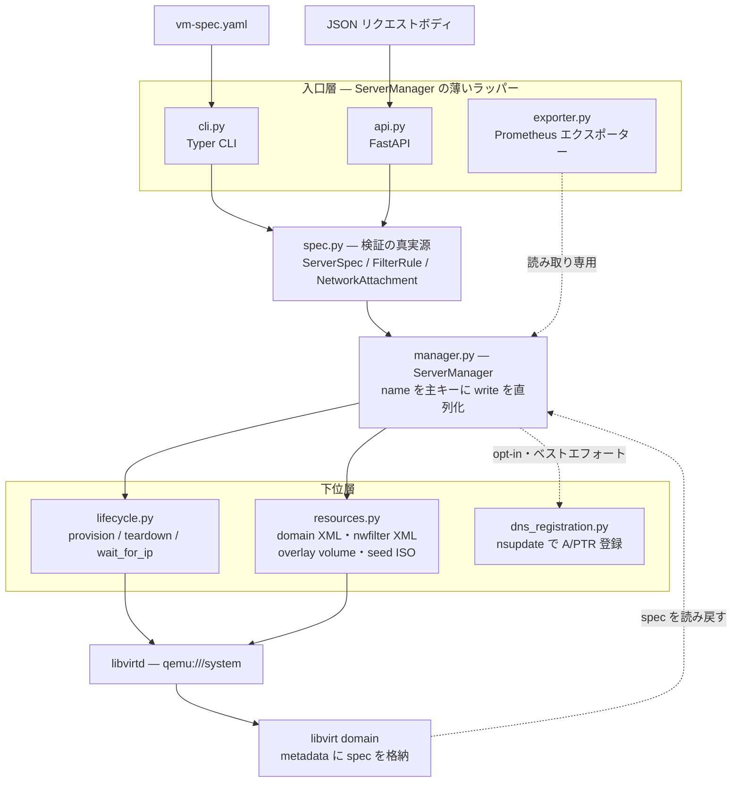
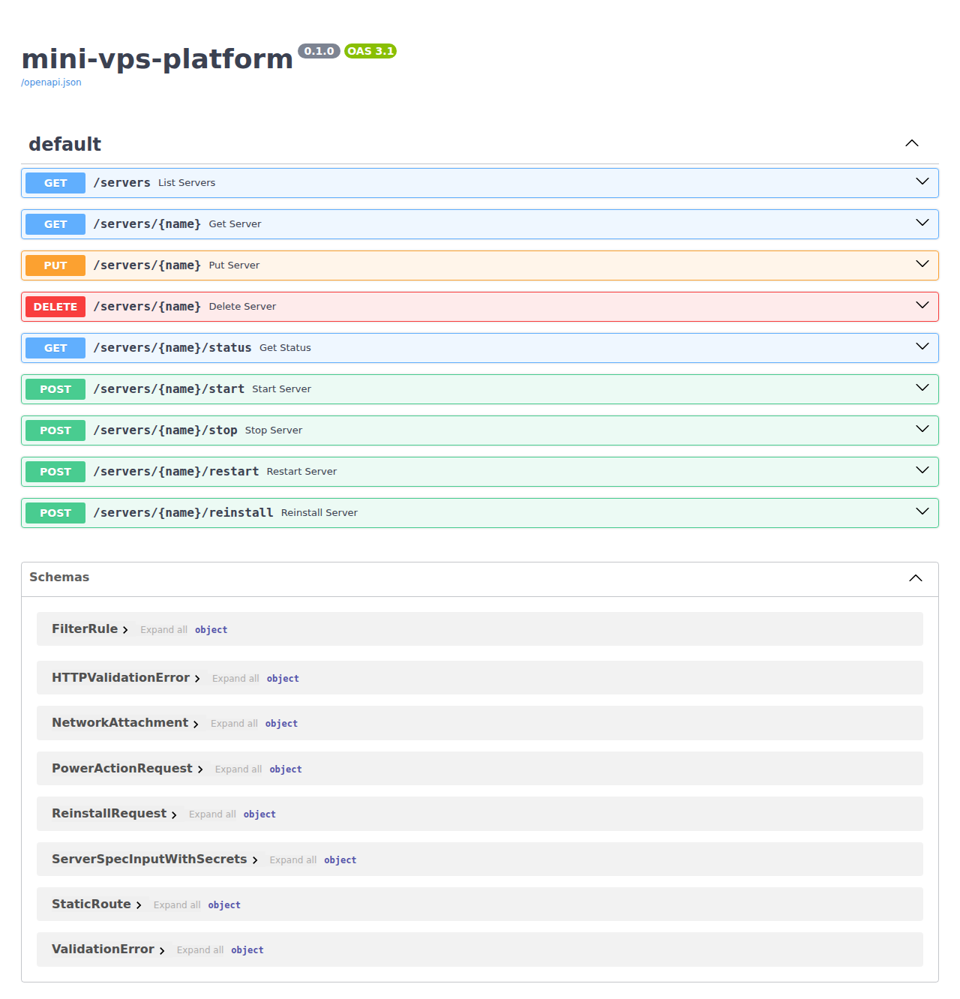
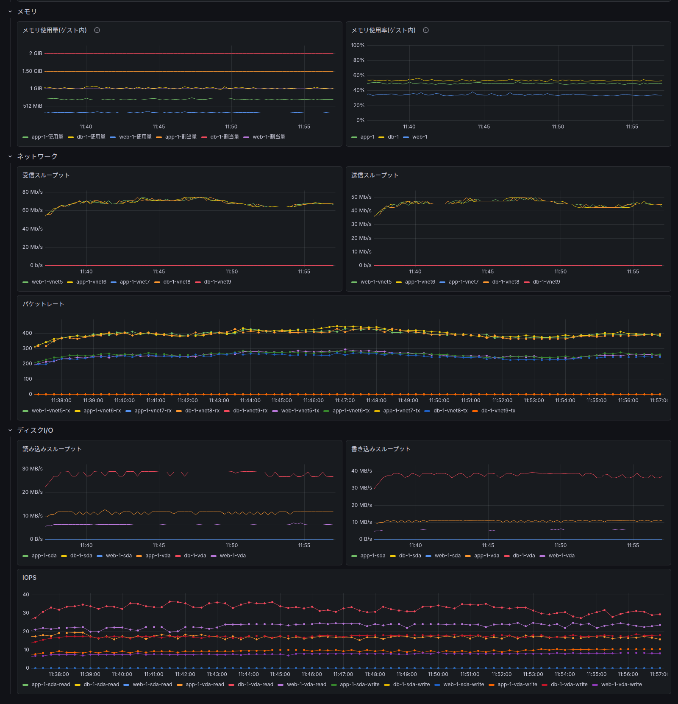

# mini-vps-platform

[](https://github.com/0x69d/mini-vps-platform/actions/workflows/ci.yml)
[](https://www.python.org/)
[](https://libvirt.org/)

QEMU/KVM + libvirt + Python で構築する、VPS サービスの最小版。

宣言的な YAML 入力を受け取り、ローカルマシン上に仮想サーバーをプロビジョニングする。
クラウドでいう「コントロールプレーン」の中核、つまり宣言的入力からリソース確保までの翻訳を自作する。



VM 3台を稼働させた状態のダッシュボード。エクスポーターが libvirt から集めたメトリクスを
Prometheus 経由で表示している。構成は
[Prometheus + Grafana](#6-prometheus--grafanadocker-compose)を参照。

## 設計

- 状態ストアを自前で持たない。spec は libvirt domain の `<metadata>` に埋め込み、
  読み出し時に同じ Pydantic モデルへ復元する。DB と libvirt を二重に持たないため、
  両者の不整合という状態が存在しない。
- CLI は YAML、Web API は JSON を受けるが、どちらも `ServerManager` を包む薄いラッパー。
  検証は `spec.py` の 1 モデルに集約してあり、入口によって通る制約は変わらない。
- 書き込み操作は VM 名単位のロックで直列化する。`create()` は既存 domain を読んでから
  差分を書くため、ロックが無いと同名への同時実行で read-modify-write が壊れる。
- 監視はリポジトリ内で完結する。エクスポーターと Grafana ダッシュボードの JSON、
  データソース設定を provisioning として持つため、手動でのダッシュボード作成が要らない。
- 待受は 3 入口とも localhost 既定。認証機構は持たず、到達できること自体を信頼境界に
  している。

## 関連リポジトリ

本リポジトリの機能だけで実現するアプライアンス VM 群。いずれも本体のコードを変更せず、
ゴールデンイメージと spec で完結する。1 VM が 1 つのミドルウェアを担う。

| リポジトリ | 役割 |
|---|---|
| [minivps-router-appliance](https://github.com/0x69d/minivps-router-appliance) | セグメント間ルーティングを行う `router-1`。[`static_routes` の例](docs/spec.md#スタティックルート)が経路を向ける先 |
| [minivps-dns-appliance](https://github.com/0x69d/minivps-dns-appliance) | 内部ドメイン `minivps.internal` の権威DNSと再帰リゾルバを提供する `dns-1`。[DNS レコード自動登録](docs/dns-registration.md)の送信先 |
| [minivps-web-appliance](https://github.com/0x69d/minivps-web-appliance) | `seg1` に web 層を提供する `web-1`。Apache を載せ、`db-1` への接続元になる |
| [minivps-db-appliance](https://github.com/0x69d/minivps-db-appliance) | `seg2` に DB 層を提供する `db-1`。MySQL を載せ、`seg1` からの接続だけを受け付ける |

4アプライアンスVMのネットワーク配置。3セグメント構成で組んだ場合の一例。



セグメントは互いに遮断された独立 NAT ネットワークで、`router-1` が全セグメントに NIC を
持って経路を提供する。`default` は各 VM の管理用で、ホストからの SSH はここを通る。
遮断に追加のファイアウォール設定は要らない。libvirt が NAT ネットワークの起動時に投入する
ネットワーク単位の FORWARD ルールがそのまま境界になる。

セグメントを何本どう切るかはプラットフォーム側では決めない。既定では作らず、
`ansible/vars/network_segments.yml` に書いたぶんだけ作る。詳細は
[docs/spec.md](docs/spec.md#ネットワークセグメント)を参照。

`web-1` から `db-1` への到達は、この遮断を `router-1` 経由で越える例になっている。
経路は spec の `static_routes` が、通してよいかは `router-1` の nftables が決める。

## スコープ

単一ホスト上でローカル完結させることが前提。

### 含むもの

- Server リソース: YAML / JSON 定義から libvirt domain を生成・起動・停止・削除する。
- NAT ネットワーク: libvirt の仮想ブリッジ経由でゲストを外向き通信させる。
- セグメント分離: 複数の独立 NAT ネットワークで VM を隔離する。
- パケットフィルタ: `filters` で宣言した inbound ポートのみ許可する。
  作成後に `vm-spec.yaml` を編集して再度 `create`/`PUT` することで変更もできる。
- 静的IP割当: `networks` の要素に `NetworkAttachment`を指定すると、cloud-init の `network-config` 経由で固定IPを割り当てる。
- 監視: Prometheus + Grafana によってメトリクスを可視化する。

### 含まないもの

- 複数物理ホストへのスケジューリング。
- マルチテナンシー、課金、認証などの大規模運用機構。
- パケットフィルタの IPv6・egress・稼働中 VM へのライブ反映。ルール変更は停止中の VM に
  限り inbound・IPv4 のみ対応。
- アラート通知。
- `networks`・`static_routes` は `create()` の可変フィールドではない。
  `startup_script` と同様、変更するには対象 VM の削除・再作成が必要。

## アーキテクチャ

上位から下位へ、各層は下位層の薄いラッパーになっている。domain XML は手書きせず、
spec から `resources.py` が生成する。



## spec

```yaml
name: web-1
memory: 1024                  # MB
vcpus: 2
base_image: ubuntu-26.04.img
disk: 10                      # GB
```

これが最小構成。全フィールドは次のとおり。

| キー | 型 | 必須/任意 | デフォルト |
|---|---|---|---|
| `name` | str（英数字・`-`・`_`、先頭は英数字、63文字以内） | CLI（YAML）では必須。API（JSON）では URL パスから与える | — |
| `memory` | int (MB, 正の整数) | 必須 | — |
| `vcpus` | int (正の整数) | 必須 | — |
| `base_image` | str | 必須 | — |
| `disk` | int (GB, 正の整数)。[`base_image` の仮想サイズ以上にすること](docs/spec.md#disk-と-base-image-の仮想サイズ) | 必須 | — |
| `hostname` | str（`name` と同じ文字種制約） | 任意 | 未指定なら `name` で補完 |
| `user` | str（小文字・数字・`-`・`_`、先頭は小文字かアンダースコア、32文字以内） | 任意 | `ubuntu` |
| `networks` | list[[str](docs/spec.md#ネットワークセグメント) \| [NetworkAttachment](docs/spec.md#複合型)]（1件以上、ネットワーク名の重複不可。文字列で書けるのは事前定義済みのネットワーク名のみ） | 任意 | `["default"]` |
| `filters` | list[[FilterRule](docs/spec.md#複合型)] \| null | 任意 | 未指定(null)なら全 inbound 許可。`[]` を明示すると全 inbound 拒否 |
| `static_routes` | list[[StaticRoute](docs/spec.md#複合型)] | 任意 | 未指定なら追加ルート無し |
| `startup_script` | str \| null | 任意 | 未指定(null)。指定する場合は既知のテンプレート名のみ許可 |

> **警告**: `filters` を1件でも宣言すると、明示したポート以外の inbound は SSH(22番)を含めて
> すべて拒否される。SSH アクセスを維持したい場合は `{port: 22, protocol: "tcp"}` を
> 自分で `filters` に含める必要がある。

各フィールドが有効にする機能の詳細は別ファイルに分けている。

| 機能 | フィールド | ドキュメント |
|---|---|---|
| ネットワークセグメント | `networks` | [docs/spec.md](docs/spec.md#ネットワークセグメント) |
| 静的IP割当 | `networks` | [docs/spec.md](docs/spec.md#静的ip割当) |
| スタティックルート | `static_routes` | [docs/spec.md](docs/spec.md#スタティックルート) |
| スタートアップスクリプト | `startup_script` | [docs/startup-scripts.md](docs/startup-scripts.md) |
| DNS レコード自動登録 | — | [docs/dns-registration.md](docs/dns-registration.md) |

静的IP割当とスタティックルートは、どちらも cloud-init 由来の制約が実装の形を決めている。
`network-config` を渡すとそれが唯一の設定源になるため、DHCP の NIC も含めて全 NIC を
MAC マッチで列挙する。`runcmd` は初回起動時にしか実行されないため、スタティックルートは
`ip route add` ではなく systemd の oneshot ユニットとして登録し、再起動をまたがせる。

## 必要環境

- Linux（KVM 対応 CPU、`/dev/kvm` 利用可）
- QEMU/KVM, libvirt デーモン
- [uv](https://docs.astral.sh/uv/)
- ビルド依存（libvirt-python は PyPI で sdist のみ提供のため、`uv add` 時にソースビルドが走る）: libvirt の開発ヘッダ + Python 開発ヘッダ（`Python.h`）+ pkg-config + C コンパイラ

### 動作確認済みホスト OS

- Ubuntu 26.04 LTS
- Fedora Linux 44

## セットアップ

### 1. ホスト側の事前設定(Ansible)

パッケージ導入(apt/dnf)・libvirtd の起動と自動起動・実行ユーザーの `libvirt`
グループ追加・default ネットワーク・セグメント NAT ネットワーク(既定では作らない。
`ansible/vars/network_segments.yml` で定義する)・`images` ストレージプール・base image・
seed ISO 置き場(`/var/lib/libvirt/seeds`)・SSH 鍵まで、Ansible playbook で一括セットアップする。

```bash
uv sync --only-group ops
uv run --only-group ops ansible-playbook -i ansible/inventory.ini ansible/playbook.yml --ask-become-pass
```

> **警告**: `sudo ansible-playbook ...` のように実行コマンド自体を sudo しないこと。
> その場合 playbook 内で実行ユーザーが root と誤認識され、seed ISO 置き場や SSH 鍵の
> 所有者が root になり、後続の VM 作成が壊れる。root 権限が必要な個々のタスクは
> playbook 内の `become: true` で昇格するため、パスワードレス sudo でなければ
> `--ask-become-pass` を付ければ十分。

> **注記**: `sudo` の既定実装が Rust 版(`sudo-rs`)のホストでは、`-p`/`--prompt` の
> 扱いの違いにより Ansible の become パスワードプロンプト検出が失敗し、
> `Timed out waiting for become success or become password prompt` で
> playbook が止まる場合がある([ansible#85837](https://github.com/ansible/ansible/issues/85837)、
> [sudo-rs#1461](https://github.com/trifectatechfoundation/sudo-rs/issues/1461)、
> 修正は将来の ansible-core リリースに追従予定)。発生した場合は GNU 版 sudo に
> 切り替えると回避できる(`sudo update-alternatives --auto sudo` で元に戻せる)。
>
> ```bash
> sudo update-alternatives --set sudo /usr/bin/sudo.ws
> ```

対応可能なゲスト OS と base image の入手・登録手順は
[docs/guest-os.md](docs/guest-os.md) を参照。

`libvirt` グループの反映にはシェルの再ログイン(または `newgrp libvirt`)が必要。

### 2. Python 依存の同期（uv）

依存は `pyproject.toml` / `uv.lock` で管理している。

```bash
uv sync
```

`libvirt-python` のバージョンは、実行環境の libvirt と同じかそれ以下に揃える（新しいバインディングを古い `.so` に当てると実行時にシンボル不足になる）。手元のバージョンは `virsh --version` で確認する。

### 3. CLI(YAML)

宣言的 YAML を渡して VM を操作する。`uv run mini-vps` または `uv run python -m mini_vps` のどちらでも同じ CLI が起動する。

```bash
uv run mini-vps create mini_vps/vm-spec.yaml
uv run mini-vps list
uv run mini-vps get web-1
uv run mini-vps status web-1
uv run mini-vps start web-1
uv run mini-vps stop web-1
uv run mini-vps restart web-1
uv run mini-vps reinstall web-1
uv run mini-vps delete web-1
```

| サブコマンド | 説明 |
|---|---|
| `create <file>` | spec YAML から VM を宣言的に作成・収束する |
| `get <name>` | spec と状態を表示する(不在なら終了コード 3) |
| `list` | 管理対象の VM 名を1行ずつ表示する |
| `status <name>` | 状態(state・ip)を表示する(不在なら終了コード 3) |
| `start <name>` | VM を起動する(起動中なら冪等に no-op、不在なら終了コード 3) |
| `stop <name> [--force]` | VM を停止する(停止中なら冪等に no-op、不在なら終了コード 3) |
| `restart <name> [--force]` | disk を保持したまま VM を再起動する(不在なら終了コード 3) |
| `delete <name>` | VM を削除する(不在/管理外なら終了コード 3) |
| `reinstall <name>` | disk を base から作り直して再起動する(不在なら終了コード 3) |

実行例。`get` が返す spec は libvirt domain の `<metadata>` から読み戻したもので、
`hostname`・`user` のように spec ファイルで指定しなかった項目も `spec.py` の既定値で
補完済みの状態になっている。以下の `...` は紙面の都合による省略で、実際は全フィールドが
キー名の昇順で並ぶ。

```console
$ uv run mini-vps list
db-1
web-1
app-1

$ uv run mini-vps status app-1
{
  "state": "running",
  "ip": "192.168.201.20"
}

$ uv run mini-vps get web-1
{
  "spec": {
    "base_image": "ubuntu-26.04.img",
    "disk": 10,
    "filters": null,
    "hostname": "web-1",
    ...
    "user": "ubuntu",
    "vcpus": 2
  },
  "status": {
    "state": "running",
    "ip": "192.168.122.236"
  }
}
```

#### 標準出力の形式

コマンドの結果は stdout、ログは stderr へ書き分ける。stdout の形式はサブコマンドごとに
決まっており、外部ツールから解析する前提で安定させている。

| サブコマンド | stdout |
|---|---|
| `list` | VM 名を1行に1件 |
| `get` / `status` | JSON オブジェクト1件(`json.dumps(indent=2)`) |
| `create`/`delete`/`start`/`stop`/`restart`/`reinstall` | 人間向けの1行メッセージ |

`status` の JSON は `{"state": ..., "ip": ...}` の2キー。`state` の取りうる値は
下記の Web API 節に挙げたものと同じ。

`create`/`reinstall` はどちらも `--startup-param KEY=VALUE`(複数回指定可)を
受け付ける。`startup_script` テンプレートに渡す秘密情報の指定方法は
[docs/startup-scripts.md](docs/startup-scripts.md) を参照。

`stop`/`restart` の既定はゲスト OS への ACPI 経由の正常なシャットダウン/再起動の
要求のみで、実際に状態が変わるまで待たない。`--force` 指定時は即座に強制する。
停止中の VM に `restart`(force 無し)を実行すると終了コード 5(`ServerNotRunning`)
で拒否する。

`create` を既存 VM に対して再実行すると、`memory`/`vcpus`/`filters` の差分のみ
収束させる(それ以外のフィールドの差分は spec 相違として終了コード 4
(`ServerConflict`)で拒否する)。収束はドメイン停止中の VM のみ許可し、
稼働中に実行すると終了コード 6(`ServerRunning`)で拒否する(先に `stop` してから
再実行する)。

#### 終了コード

| コード | 意味 |
|---|---|
| 0 | 成功 |
| 1 | spec ファイル関連のエラー(検証エラー・YAML 構文・入出力・`--startup-param` 形式不正) |
| 2 | コマンドラインの使用法エラー(不明なオプション、引数不足) |
| 3 | `ServerNotFound` — 対象 VM が存在しない、または管理対象外 |
| 4 | `ServerConflict` — 既存 VM の spec と不一致 |
| 5 | `ServerNotRunning` — 停止中の VM に稼働前提の操作を要求した |
| 6 | `ServerRunning` — 稼働中の VM に停止前提の操作を要求した |
| 7 | libvirt エラー(`libvirtd` 停止・接続不可など) |

1 は入力(spec ファイル・`--startup-param`)の誤り、3 以降は VM の状態に起因する
拒否を表す。2 は Click(Typer の基盤)が `UsageError` に予約しているため使わない。

### 4. Web API(JSON)

他サービス向けの入口。宣言的 YAML は CLI 向け、API は JSON で分離する。

```bash
uv run uvicorn mini_vps.api:app
```

OpenAPI ドキュメントは <http://127.0.0.1:8000/docs> で確認できる。



スキーマ定義は `spec.py` の Pydantic モデルから自動生成される。`FilterRule`・
`NetworkAttachment`・`StaticRoute` は CLI が YAML から読むのと同じモデル。

> **警告**: API に認証機構は無い。到達できることがそのまま全操作の権限になるため、
> 既定の `127.0.0.1:8000` という loopback 限定の待受がそのまま信頼境界になっている。
> `--host 0.0.0.0` などで待受アドレスを広げると、ゲストネットワークや LAN から
> 無認証で VM の作成・削除ができる状態になる。広げる場合はファイアウォールや
> リバースプロキシでの認証を別途用意すること。

| メソッド | パス | 説明 |
|---|---|---|
| `GET` | `/servers` | 管理対象の VM 名一覧 |
| `GET` | `/servers/{name}` | spec と状態(不在なら 404) |
| `GET` | `/servers/{name}/status` | 状態 state・ip(不在なら 404) |
| `PUT` | `/servers/{name}` | 宣言的な作成/収束(新規 201・完全一致の no-op/収束 200・spec 相違 409) |
| `POST` | `/servers/{name}/start` | VM を起動する(起動中なら冪等に no-op、不在/管理外 404) |
| `POST` | `/servers/{name}/stop` | VM を停止する(停止中なら冪等に no-op、不在/管理外 404) |
| `POST` | `/servers/{name}/restart` | disk を保持したまま VM を再起動する(不在/管理外 404) |
| `DELETE` | `/servers/{name}` | 削除(成功 204・不在/管理外 404) |
| `POST` | `/servers/{name}/reinstall` | disk を base から作り直して再起動(不在/管理外 404) |

`GET /servers/{name}/status` が返す `state` は libvirt の domain state をそのまま
文字列にしたもので、`nostate`・`running`・`blocked`・`paused`・`shutdown`・`shutoff`・
`crashed`・`pmsuspended` のいずれか。libvirt が未知の値を返した場合のみ `unknown` に
落ちる。真実源は `mini_vps/manager.py` の `STATE_NAMES`。稼働中かどうかを判定する
利用者は `state == "running"` を見ればよく、それ以外の値をまとめて「停止相当」として
扱ってよい。`ip` は複数 NIC でも最初の1件のみで、静的アドレスを持つ NIC があれば
起動状態に関わらずそれを優先する。

`PUT`/`POST .../reinstall` の JSON body には、`startup_script` テンプレートに渡す
秘密情報として `secrets` フィールドを追加で渡せる。詳細は
[docs/startup-scripts.md](docs/startup-scripts.md) を参照。

`stop`/`restart` の既定動作は CLI の `stop`/`restart`(上記参照)と同じ。強制は
JSON body に `{"force": true}` を渡し、状態変化は `GET /servers/{name}/status`
でポーリングして確認する。停止中の VM への `restart`(force 無し)は CLI 同様
拒否され、API では 409(`ServerNotRunning`)で返る。

収束の挙動は CLI の `create`(上記参照)と同じ。API では `ServerConflict`・
`ServerRunning` のどちらも 409 で返る。

エラーの正規化は CLI の終了コードと対応させている。入力の誤りは 422(CLI の 1)、
`ServerNotFound` は 404(3)、`ServerConflict`・`ServerNotRunning`・`ServerRunning` は
409(4・5・6)、起動後に libvirt 側の障害が起きた場合は 503(7)で返る。libvirt 接続は
プロセス起動時に一度だけ開くため、起動時点で `libvirtd` が停止していれば
503 ではなくプロセスの起動自体が失敗する。

### 5. Prometheus エクスポーター

管理対象 VM の CPU・メモリ・ネットワーク・ディスク I/O・起動状態を Prometheus 形式で公開する。
Web API とは別の独立プロセスとして動く。

```bash
uv run python -m mini_vps.exporter
```

メモリは2系統を公開する。`minivps_vm_memory_current_bytes`/`_maximum_bytes` は
libvirt が見ている balloon の割当量で、`minivps_vm_memory_guest_total_bytes`/
`_guest_usable_bytes` はゲストの virtio_balloon ドライバが報告する実使用量。後者は
domain XML の `<memballoon>` に `<stats period>` を持たせて初めて更新されるため、
この設定を入れる前に作成した VM では出てこない。削除・再作成すると付く。
ゲスト内の使用量は `guest_total - guest_usable` で、ゲストの `MemTotal - MemAvailable`
に対応する。

既定では `127.0.0.1:9177/metrics` で待ち受ける(同一ホスト上で動く Prometheus サーバーからの
スクレイプを想定。単一ホスト上でローカル完結させるという本プロジェクトの前提に合わせている)。
`MINIVPS_EXPORTER_PORT`・`MINIVPS_EXPORTER_ADDR` 環境変数でポート・待受アドレスを変更できる。
認証機構は無いため、待受アドレスを変更して外部公開する場合はファイアウォール等で
アクセス元を制限すること。

メトリクスの可視化(Prometheus + Grafana)は `### 6. Prometheus + Grafana(docker-compose)` を参照。

### 6. Prometheus + Grafana(docker-compose)

`5.` の exporter が公開するメトリクスを Prometheus でスクレイプし、Grafana で
可視化する。Docker(docker compose v2 プラグイン込み)が導入済みであること、
`5.` の exporter が `127.0.0.1:9177` で起動済みであることが前提。

```bash
uv run python -m mini_vps.exporter &   # 別ターミナルで起動していれば不要
cp .env.example .env                   # GF_SECURITY_ADMIN_PASSWORD を書き換えること
docker compose up -d
```

- Prometheus UI: <http://127.0.0.1:9090>
- Grafana: <http://127.0.0.1:3000>(ログイン情報は `.env` の
  `GF_SECURITY_ADMIN_USER`/`GF_SECURITY_ADMIN_PASSWORD`)。ログイン後、
  「mini-vps-platform」フォルダの「mini-vps-platform Overview」ダッシュボードで
  VM ごとの CPU・メモリ・ネットワーク・ディスク I/O・起動状態を確認できる。

メモリ・ネットワーク・ディスク I/O のパネルは次のとおり。



ネットワークとディスク I/O は NIC・ブロックデバイス単位に分解して表示する。系列名は
ホスト側の tap デバイス名とゲストのブロックデバイス名。tap デバイスの番号はホスト全体の
通し番号なので、複数 NIC の VM では連続した2つが同じ VM のものになる。ブロックデバイスは
`vda` が overlay volume、`sda` が seed ISO。

Prometheus・Grafana とも `network_mode: host` で動作し、`127.0.0.1` にのみ bind する
(exporter と同じく単一ホスト内で完結させ、外部には公開しない)。

停止する場合は `docker compose down`(データは named volume に残る)。データも含めて
完全に削除する場合は `docker compose down -v` を使う。

## ログ

CLI・Web API・エクスポーターの3入口とも、ログは stderr に出力する。CLI の stdout は
コマンド結果専用なので、`uv run mini-vps list > servers.txt` のようにリダイレクトしても
ログは混ざらない。

既定のレベルは WARNING。詳しくするには CLI では `-v`(INFO)/`-vv`(DEBUG)を使う。
グループオプションなのでサブコマンドより前に置くこと(`mini-vps -v get web-1`)。

```bash
uv run mini-vps -v create mini_vps/vm-spec.yaml
uv run mini-vps -vv get web-1
```

`MINIVPS_LOG_LEVEL` 環境変数でも指定でき、3入口すべてに効く。レベル名(`DEBUG`)と
数値(`10`)のどちらも受け付ける。解釈できない値は WARNING に落ちる。

```bash
MINIVPS_LOG_LEVEL=INFO uv run uvicorn mini_vps.api:app
MINIVPS_LOG_LEVEL=DEBUG uv run python -m mini_vps.exporter
```

VM の spec 本文・cloud-init の user-data 本文・スタートアップスクリプトの
secrets はどのレベルでも出力しない。DEBUG でも出るのは VM 名やネットワーク名など、
libvirt の metadata に既に載っている値だけである。
